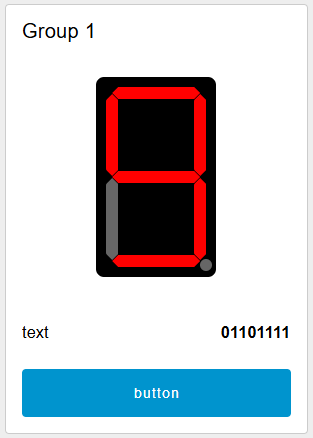

# node-red-dashboard-2-ui-seven-segment-display

A seven-segment display widget for the Node-RED Dashboard 2.0.



## Installation

You can install this node from the "Manage Palette" menu in the Node-RED interface.
Alternatively, run the following command in your Node-RED user directory:

```
npm install @yoshoku/node-red-dashboard-2-ui-seven-segment-display
```

## Segment pattern

Each segment is assigned a letter from a to g, and the dot in the bottom right corner is assigned dp.

```
 --a--
|     |
f     b
|     |
 --g--
|     |
e     c
|     |
 --d--  (dp)
```

The segment pattern is represented by an 8-bit string.

```
dp g f e d c b a
 0 0 0 0 0 1 1 1
```

This bit string is converted to a decimal number from 0 to 255 or a headecimal number
according to the type of the value property.

## Value property

- **str**: Expects hexadecimal strings (e.g. '6F') to be passed.
- **num**: Expects integers from 0 to 255 to be passed.
- **msg**: When a `number` type value is passed, it is processed the same as `num`. For other types, it is processed the same as `str`.

## License

node-red-dashboard-2-ui-seven-segment-display is available as open source under
the terms of the [Apache-2.0 License](https://github.com/yoshoku/node-red-dashboard-2-ui-seven-segment-display/blob/main/LICENSE).
